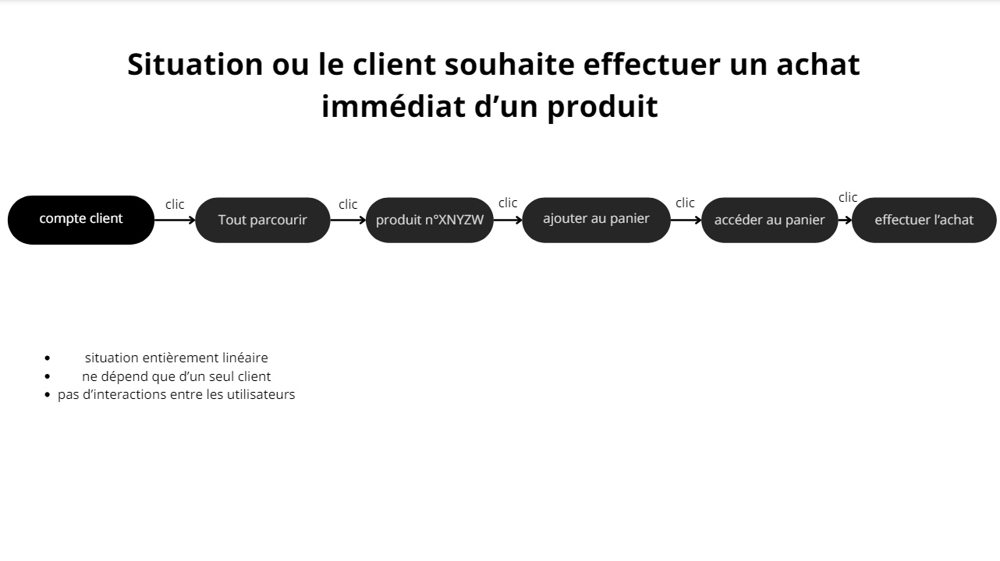
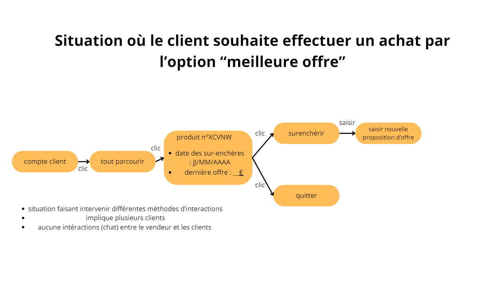
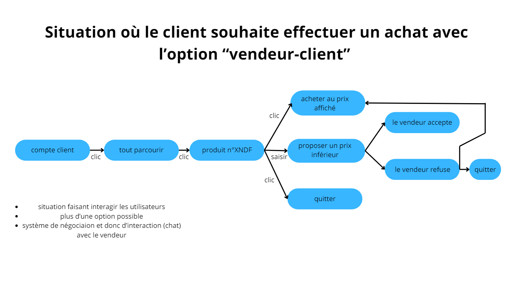

# Projet Agora

## Outils nécessaires

- [Php 8.2 ou supérieur](https://wampserver.aviatechno.net/)
- [Composer](https://getcomposer.org/download/)
- [Symfony CLI](https://symfony.com/download)
- [Serveur MySql](https://wampserver.aviatechno.net/)

## Lancement du projet

```powershell
  C:\piscine> git clone https://github.com/eleonorevidement/agoraSymfony.git
  C:\piscine> cd agoraSymfony
  C:\piscine\agoraSymfony> composer install
  C:\piscine\agoraSymfony> symfony server:start
```

## Storyboards



